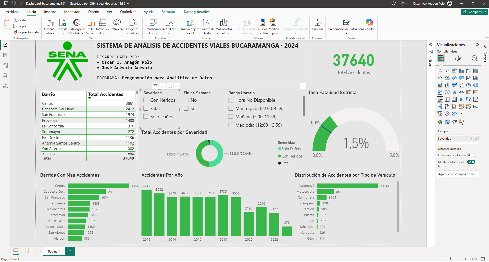
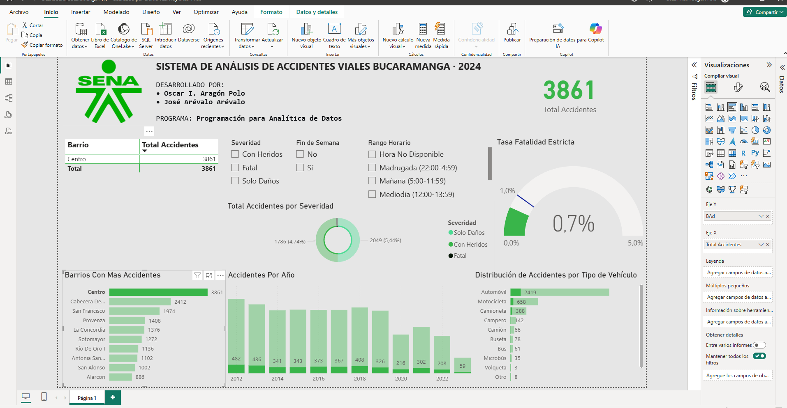

# Sistema de análisis de accidentalidad vial – Bucaramanga

Dashboard interactivo en Power BI para identificar patrones de accidentalidad vial en Bucaramanga a partir de **37.640 registros reales** de datos abiertos (2012–2023).

Proyecto final del programa **Técnico en Programación para Analítica de Datos (SENA)**, desarrollado en equipo con José Arévalo.



---

## 1. Problema

Las autoridades de tránsito tienen años de registros de accidentes, pero sin una herramienta que permita explorarlos es difícil responder preguntas como:

- ¿En qué barrios se concentran los accidentes?
- ¿Cómo ha evolucionado la accidentalidad en el tiempo?
- ¿Qué tipos de vehículo participan más?
- ¿Cuándo es más grave un accidente?

## 2. Objetivo

Construir un dashboard que convierta los datos crudos en información clara para usuarios no técnicos, con filtros cruzados que permitan explorar los datos por severidad, horario y fin de semana.

## 3. Datos

- **Fuente:** Alcaldía de Bucaramanga, *Datos abiertos de accidentalidad vial (Accidentes de tránsito)*. https://www.bucaramanga.gov.co/datos/
- **Periodo:** 2012–2023
- **Tamaño original:** 39.193 registros y 24 variables
- **Después de la limpieza:** 37.640 registros (se conserva el 96 %)

## 4. Herramientas

| Herramienta | Uso |
|---|---|
| Power Query | Limpieza y transformación de los datos |
| Power BI Desktop | Modelo de datos y visualizaciones |
| DAX | Medidas y KPIs (por ejemplo, tasa de fatalidad) |

## 5. Proceso

1. **Limpieza (Power Query):** eliminación de registros incompletos (~4 %), estandarización de textos y validación de fechas y horas.
2. **Variables derivadas:** rangos horarios (madrugada, mañana, mediodía…), indicador de fin de semana y niveles de severidad.
3. **Modelo y medidas (DAX):** total de accidentes y tasa de fatalidad, que responde a los filtros del dashboard.
4. **Visualización:** KPIs, tabla de barrios, series por año, distribución por vehículo y segmentadores interactivos.

## 6. Resultados



- **Barrio Centro:** concentra 3.861 accidentes, el **10,3 %** del total. Los 5 barrios con más accidentes suman cerca del **29 %**.
- **Vehículos:** los automóviles participan en el **62 %** de los accidentes (23.341) y las motocicletas en el **17 %** (6.510).
- **Severidad:** el 50,0 % son solo daños, el 48,5 % con heridos y el **1,5 %** fatales (559 casos).
- **Tendencia:** pasó de 4.217 accidentes en 2012 a 2.127 en 2022, una reducción cercana al **50 %**, con una caída marcada desde 2020.

## 7. Limitaciones

- **2023 es un año parcial** (878 registros), por lo que no se usa para hablar de tendencias.
- El análisis es descriptivo: muestra dónde y cuándo ocurren los accidentes, no sus causas.
- La actualización de datos requiere repetir el proceso de limpieza manualmente.

## 8. Posibles mejoras

- Repetir la limpieza y el análisis con Python y Pandas en un notebook.
- Cargar los datos limpios en una base de datos SQL.
- Agregar un mapa geográfico y datos de clima o de flujo vehicular.
- Automatizar la actualización mensual.

## 9. Contenido del repositorio

```
├── README.md
├── dashboard/
│   └── Dashboard_bucaramanga.pbix
└── docs/
    ├── Informe_Proyecto.pdf
    └── images/
        ├── dashboard_general.png
        └── dashboard_filtro_centro.png
```

Para abrir el dashboard se necesita [Power BI Desktop](https://powerbi.microsoft.com/desktop/) (gratuito, solo Windows).

## Autor

**Oscar Iván Aragón Polo** – Técnico en Programación para Analítica de Datos (SENA)
[LinkedIn](https://www.linkedin.com/in/oscar-aragon27/) · [GitHub](https://github.com/Oscararagon27)
